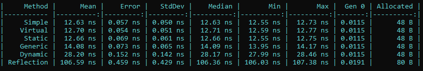

# Результаты моего Benchmark

Как видно из таблички, использование обычных, статических и виртуальных методов
выдаёт одинаковое время, generic-метод отработал с примерно таким же временем

Вызов dynamic метода происходит примерно в 2 раза медленнее предыдущих

И самое долгое отрабатывает reflection в 9 раз медленнее вызова обычного метода